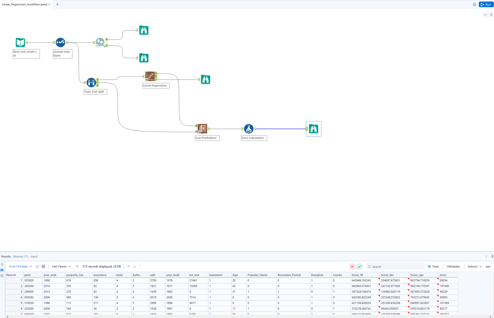

# Linear Regression – Real Estate Price Prediction (Alteryx)

## Overview
This project demonstrates an end-to-end **Linear Regression modeling workflow** built using **Alteryx Designer** to predict real estate prices.  
The workflow covers data ingestion, data type standardization, correlation analysis, train-test splitting, model training, scoring, and error evaluation.

This project emphasizes **model interpretability, analytical reasoning, and best practices** in no-code machine learning.

## Workflow Overview



---

## Input Data
- **File:** `final_real_estate.csv`
- **Source:** Generated from the *Real Estate Data Preparation* Alteryx workflow
- **Tool Used:** Input Data tool

---

## Workflow Steps

### 1. Input Data & Data Type Configuration
- Load `final_real_estate.csv` using the **Input Data tool**
- Apply a **Select tool** to:
  - Assign correct data types based on the data dictionary
  - Remove unknown fields
  - Rename or filter columns as required
- The Select tool is annotated as **“Change data types”** for clarity and documentation

---

### 2. Association Analysis (Correlation)
- Use the **Association Analysis tool** to analyze relationships between independent variables and the target variable
- Configuration:
  - Target variable: `price`
  - Excluded fields: `price`, `condo`
  - Correlation method: **Pearson product-moment correlation**
- Outputs:
  - Correlation matrix
  - Interactive heatmap visualization
- Browse tools are connected to both output anchors for inspection

---

### 3. Train–Test Split
- Use the **Create Samples tool** to split the dataset
- Purpose:
  - Training data → model development
  - Testing data → model evaluation on unseen data
- Tool annotations are used to clearly label outputs

---

### 4. Linear Regression Model Training
- Use the **Linear Regression tool** from the Predictive category
- Configuration:
  - Dependent variable: `price`
  - Independent variables: selected numeric predictors
- A Browse tool is attached to review model coefficients and performance statistics

---

### 5. Model Scoring (Test Data)
- Apply the trained model to the test dataset using the **Score tool**
- Inputs:
  - Model object from the Linear Regression tool
  - Test dataset
- Output includes predicted values for the target variable

---

### 6. Error Calculation
- Use the **Formula tool** to calculate prediction error:
  ```text
  abs([Score_fit] - [price])
