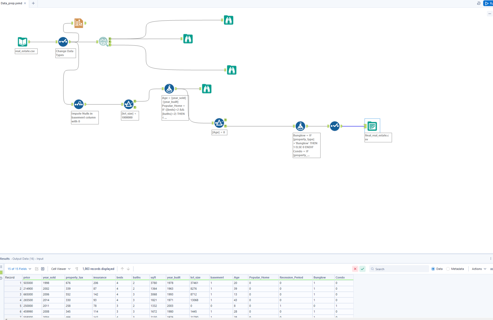

# Exploratory Data Analysis & Data Preparation – Real Estate (Alteryx)

## Overview
This workflow performs **exploratory data analysis (EDA)** and **data preparation** on a real estate dataset using **Alteryx Designer**.  
The objective is to clean, analyze, transform, and engineer features so the data is **ready for machine learning models** in subsequent workflows.

The workflow includes data type standardization, statistical profiling, visualization, missing value treatment, outlier handling, feature engineering, categorical encoding, and final dataset export.

---

## Input Data
- **File:** `real_estate.csv`
- **Tool Used:** Input Data tool
- The dataset is loaded directly by dropping the CSV on the canvas or by configuring the Input Data tool.

---

## Workflow Steps

### 1. Data Type Configuration
- A **Select tool** is applied to:
  - Assign correct data types based on the data dictionary
  - Remove unknown fields
  - Filter unnecessary columns if required
- This ensures consistency and correctness for downstream analysis.

---

### 2. Field Summary & Statistical Profiling
- A **Field Summary tool** is connected to the Select tool.
- Configuration:
  - All columns are selected for analysis.
- Outputs:
  - **O (Output):** Confirms data type consistency
  - **I (Interactive):** Displays distributions and value frequencies
  - **R (Report):** Generates a static statistical summary
- Browse tools are connected to all outputs for inspection.

---

### 3. Interactive Data Visualization
- An **Interactive Chart tool** is used to explore relationships visually.
- Example visualizations:
  - Box plot of **Sqft vs Property Type**
  - Bar chart of **Property Type distribution**
- These charts help identify patterns, distributions, and potential anomalies.
- Observations such as higher square footage for bungalows are identified.

---

## Data Preparation

### 4. Missing Value Treatment
- An **Imputation tool** is used to handle missing values.
- Configuration:
  - Replace null values in the `basement` column with `0`
- This ensures numerical consistency for modeling.

---

### 5. Outlier Removal
- A **Filter tool** is applied to remove extreme outliers.
- Example:
  - Records with `lot_size >= 1,000,000` are removed
- This step eliminates unrealistic data points that could skew models.

---

### 6. Feature Engineering
A **Formula tool** is used to create new features:

- **Age**
  - Derived from year-based calculations
- **Popular_Home**
  ```text
  IF ([beds]=2 && [baths]=2) THEN 1 ELSE 0 ENDIF
'''

  ### Recession_Period
A new feature is created to indicate whether a property was sold during the recession period.

IF ([year_sold]>=2010 && [year_sold]<=2013) THEN 1 ELSE 0 ENDIF

- All newly created columns are set to Int64
- A Browse tool is used to validate the new columns

---

## Data Validation

- Records with negative Age values are identified
- These records are removed using a Filter tool
- This ensures logical consistency in the dataset

---

## Categorical Encoding

The categorical column property_type is converted into numerical flags using a Formula tool.

Bunglow  
IF [property_type]='Bunglow' THEN 1 ELSE 0 ENDIF

Condo  
IF [property_type]='Condo' THEN 1 ELSE 0 ENDIF

- Data types are set to Int64
- A Select tool is used to drop the original string-based property_type column

---

## Final Dataset Export

- An Output Data tool is added at the end of the workflow
- Output file: final_real_estate.csv
- The dataset is validated using a Browse tool before saving
- This file is used as input for the Linear Regression modeling workflow

---

## Workflow Image



---

## Output

- Cleaned and feature-engineered dataset: final_real_estate.csv
- Statistical summaries and distributions
- Interactive visualizations
- Machine-learning-ready numerical dataset

---

## Tools Used

- Input Data
- Select
- Field Summary
- Interactive Chart
- Imputation
- Filter
- Formula
- Browse
- Output Data

---

## Key Learning Outcomes

- Performing exploratory data analysis using statistical summaries and visualizations
- Identifying and treating missing values and outliers
- Engineering meaningful features for machine learning
- Encoding categorical variables for numerical modeling
- Preparing clean, validated datasets for downstream ML workflows

---

## Notes

- Browse tools are used after major transformations to validate results
- Tool annotations are used to improve workflow readability and maintainability
- This workflow focuses on data quality, interpretability, and ML readiness, not model training
- Designed for academic learning and analytical demonstration purposes
---
